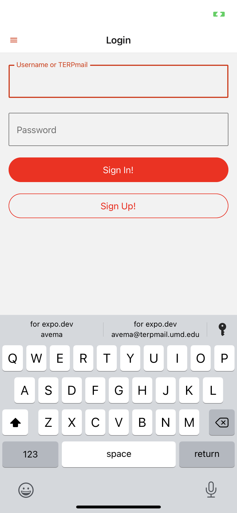

# LowKeyUMD
 ## Overview
This is a react native mobile app allows only UMD students to post anonymous posts that are visible to everyone. However, everyone remains anonymous unless they choose an obvious username. The application is almost done, with some minor cosmetic details requiring my attention. Other than that, the application works as well as twitter.
 
 
## Authentication
Authentication is done using Firebase Authentication. All user accounts are created as email/password accounts, and only students with a TERPmail can create an account with this app. 
Upon registration, they recieve an email verification to the provided TERPmail at Sign Up. Once they verify their email, they are granted access to the app. 
The registration only asks for username, terpmail, and a password. No other data is required and every TERPmail address is only allowed 1 account. 

## Storage
Firebase Firestore is used to store data about the users and any content and posts they create or interact with. Posts and their content, including their like and dislike counts are stored in firestore and when it is time to render the feed, the app fetches the latest posts and displays the data on the feed screen.

